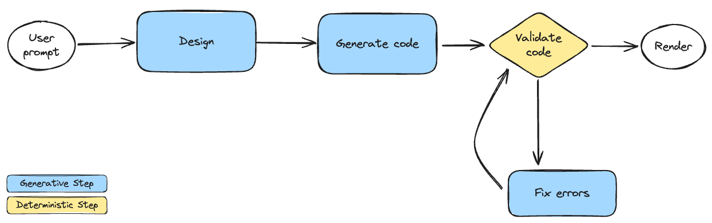

# Create your own v0 exploiting generative AI

## Setup

1. Install backend project dependencies
    ```shell
    cd backend
    pnpm i
    ```
2. Install frontend project dependencies
    ```shell
    cd ../frontend
    pnpm i
    ```
3. Copy `backend/sample.env` in `backend/config.env`
4. Paste the OpenAI API key from the chat into `backend/config.env`

## Workshop checkpoints

Start from the `main` branch and checkout the following branches to see the code changes for each step:

- 1-design-step-simple
- 2-design-step-structured-output
- 3-code-generation-step
- 4-fix-errors-step
- 5-fix-errors-iteratively-step

## Pipeline prototype



### Design Step

`Generative Task`

- A preliminary ideation step where no code is involved
- The user's request is enriched and converted into a list of components from our component library to be used

```typescript
import { DesignNewComponentOutput, PipelineInputs } from '../utils/types';

export async function designStep(inputs: PipelineInputs): Promise<DesignNewComponentOutput> {
  // Retrieve context
  // Prepare prompt messages
  // Invoke llm
  // Parse/format output
}
```

### Code Generation Step

`Generative Task`

- Code generation step where the user's request is converted into code
- The components listed in the previous step are used to generate the code

```typescript
import { DesignNewComponentOutput } from '../utils/types';

export async function codeGenerationStep(inputs: DesignNewComponentOutput): Promise<string> {
  // Retrieve context
  // Prepare prompt messages
  // Invoke llm
  // Parse/format output
}
```

### Validation Step

`Deterministic Task`

- Sometimes llm can generate code that is not valid, this step is used to ensure that the generated code is valid
- The TypeScript source code is checked and transpiled to JSX to be rendered with `react-dom/server` API

```typescript
import { ValidationOutput } from '../utils/validation';

export function validationStep(sourceCode: string): ValidationOutput {
  // Validate and transpile TypeScript source code to JavaScript
  // Test JSX rendering
  // Return validation output
}
```

### Fix Errors Step

`Generative Task`

- If the generated code is not valid, this step is used to fix the errors

```typescript
export async function fixErrorsStep(sourceCode: string, errors: string[]): Promise<string> {
  // Prepare prompt messages
  // Invoke llm
  // Parse/format output
}
```
